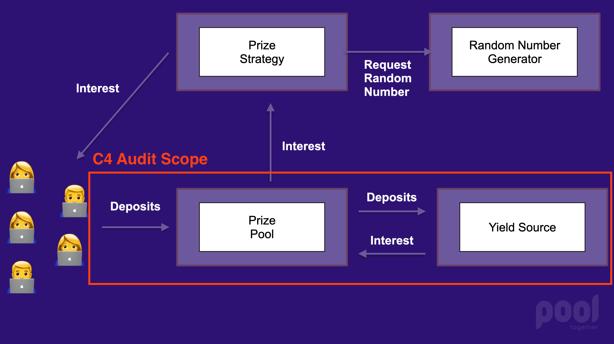

# Contest Scope

[PoolTogether](https://pooltogether.com) is a protocol that gamifies interest.  Users deposit funds into a "Prize Pool".  The Prize Pool uses a Yield Source to generate interest.  The interest is then exposed to a Prize Strategy, which distributes the interest as prizes. For a thorough introduction to the protocol, please refer to the [Protocol Overview](https://docs.pooltogether.com/protocol/overview) developer documentation.

The scope of this contest includes the PoolTogether Protocol contracts that escrow funds.  We want wardens to focus exclusively on the security of user deposits.  The PoolTogether Protocol architecture is shown below and the aspect under audit is outlined in red.



# Contracts

User deposits are held by the core Prize Pool, Yield Source implementations, and the corresponding tokens.

## PrizePool.sol

The [PrizePool](./contracts/PrizePool.sol) contract is the primary point of entry for users: deposits and withdrawals occur here.  The contract is abstract, and has two subclasses that handle escrowed funds differently: StakePrizePool and YieldSourcePrizePool.

- 1130 Lines of Code, including natspec.
- Source file in containing project: [PrizePool.sol](https://github.com/pooltogether/pooltogether-pool-contracts/blob/cbec82befa502500c63b59a9d0dabd678d3dd508/contracts/prize-pool/PrizePool.sol)
- External calls:
  - Controlled Tokens (tickets, sponsorship)
  - Reserve Registry (to lookup reserve)
  - Reserve Contract (to calculate reserve)
  - Prize Strategy (token listener)
- Libraries:
  - SafeMath
  - SafeCast
  - SafeERC20
  - ERC165Checker
  - MappedSinglyLinkedList
  - FixedPoint

## YieldSourcePrizePool.sol

This subclass of the PrizePool ferries deposits into an external Yield Source contract.

- 82 Lines of code, including natspec
- Source file in containing project: [YieldSourcePrizePool.sol](https://github.com/pooltogether/pooltogether-pool-contracts/blob/cbec82befa502500c63b59a9d0dabd678d3dd508/contracts/prize-pool/yield-source/YieldSourcePrizePool.sol)
- External calls (in addition to Prize Pool externals):
  - Yield Source
- No additional libraries

## StakePrizePool.sol

The [StakePrizePool](./contracts/StakePrizePool.sol) is a subclass of the PrizePool that simply holds the deposited tokens.  No yield is generated, so prizes must be added manually.

- 72 Lines of code, including natspec
- Source file in containing project: [StakePrizePool.sol](https://github.com/pooltogether/pooltogether-pool-contracts/blob/cbec82befa502500c63b59a9d0dabd678d3dd508/contracts/prize-pool/stake/StakePrizePool.sol)
- No external calls on top of Prize Pool
- No additional libraries

## ControlledToken.sol

The [ControlledToken](./contracts/ControlledToken.sol) extends the standard ERC20 token (OpenZeppelin flavour) and adds a "token controller" is that able to burn and mint tokens.  The controller can also "listen" to token transfers and is called anytime a transfer occurs.  The token additionally extends the (at the time) experimental ERC20Permit contract provided by OpenZeppelin.

When a Prize Pool is created an array of Controlled Tokens is passed to it.  These tokens serve as receipts for the deposited collateral.  The controller for all of the Controlled Tokens for a prize pool must be the prize pool itself.

- 82 Lines of code, including natspec
- Source file in containing project: [ControlledToken.sol](https://github.com/pooltogether/pooltogether-pool-contracts/blob/cbec82befa502500c63b59a9d0dabd678d3dd508/contracts/token/ControlledToken.sol)
- External calls:
  - TokenController (the prize pool)
- No additional libraries

## Ticket.sol

The [Ticket](./contracts/Ticket.sol) extends the above Controlled Token and adds a special data structure that organizes the token holders into contiguous blocks.  Visualizations can be found in [this article](https://medium.com/pooltogether/how-pooltogether-selects-winners-9301f8d76730).

- 85 Lines of code, including natspec
- Source file in containing project: [Ticket.sol](https://github.com/pooltogether/pooltogether-pool-contracts/blob/cbec82befa502500c63b59a9d0dabd678d3dd508/contracts/token/Ticket.sol)
- No additional external calls
- Libraries:
  - [SortitionSumTreeFactory](https://github.com/pooltogether/sortition-sum-tree-factory)

## ATokenYieldSource.sol

The [ATokenYieldSource](./contracts/yield-source/ATokenYieldSource.sol) is an adapter for Aave V2 Lending Pools that implements the [IYieldSource.sol](https://github.com/pooltogether/yield-source-interface) interface.

- 263 Lines of code, including natspec
- Source file in containing project: [ATokenYieldSource.sol](https://github.com/pooltogether/aave-yield-source/blob/bc65c875f62235b7af55ede92231a495ba091a47/contracts/yield-source/ATokenYieldSource.sol)
- External calls:
  - Aave V2 LendingPoolAddressesProviderRegistry
  - Aave V2 LendingPoolAddressesProvider
  - Aave V2 LendingPool
  - Aave V2 aToken
  - ERC20 token used to deposit
- Libraries:
  - SafeMath (OpenZeppelin)
  - SafeERC20 (OpenZeppelin)

## YearnV2YieldSource.sol

The [YearnV2YieldSource](./contracts/yield-source/YearnV2YieldSource.sol) is an adapter for [Yearn V2 Vaults](https://docs.yearn.finance/products/yvaults/v2-yvaults) that implements the [IYieldSource.sol](https://github.com/pooltogether/yield-source-interface) interface.

- 276 Lines of code
- Source file in containing project: [YearnV2YieldSource.sol](https://github.com/pooltogether/pooltogether-yearnv2-yield-source/blob/a34857f1555908a6263d2ebd189f0cb40e1858da/contracts/yield-source/YearnV2YieldSource.sol)
- External calls:
  - Yearn V2 Vault
  - ERC20 token used to deposit
- Libraries:
  - SafeERC20 (OpenZeppelin)
  - SafeMath (OpenZeppelin)

## SushiYieldSource.sol

The [SushiYieldSource](./contracts/yield-source/SushiYieldSource.sol) is an adapter for [SushiBar](https://docs.sushi.com/products/the-sushibar) that implements the [IYieldSource.sol](https://github.com/pooltogether/yield-source-interface) interface.

- 276 Lines of code
- Source file in containing project: [SushiYieldSource.sol](https://github.com/pooltogether/pooltogether-yearnv2-yield-source/blob/a34857f1555908a6263d2ebd189f0cb40e1858da/contracts/yield-source/SushiYieldSource.sol)
- External calls:
  - Yearn V2 Vault
  - ERC20 token used to deposit
- Libraries:
  - SafeERC20 (OpenZeppelin)
  - SafeMath (OpenZeppelin)

## Idle Yield Source

The [IdleYieldSource](./contracts/yield-source/IdleYieldSource.sol) is an adapter for Idle's [Idle Token](https://developers.idle.finance/interface) that implements the [IYieldSource.sol](https://github.com/pooltogether/yield-source-interface) interface.

- 160 Lines of code
- Source file in containing project: [IdleYieldSource.sol](https://github.com/sunnyRK/IdleYieldSource-PoolTogether/blob/6dcc419e881a4f0f205c07c58f4db87520b6046d/contracts/IdleYieldSource.sol)
- External calls:
  - Idle Token
  - Underlying asset ERC20 token
- No libraries

# Areas of Concern

Here are some thing we're guessing may be problematic, so want to point out for efficiency's sake.

## Floating Point Math

These contracts make use of floating point math.  Underflow and overflow are always a concern, especially when packing token amounts into uint128.  Rounding has also been known to be challenging, as numbers can behave unexpectedly.

## Boundary Conditions

As a consequence of the yield source interface, there is a common pattern among yield sources to exchange the tokens to shares then burn the shares.

Notice in this code from the [YearnV2YieldSource.sol#L140](https://github.com/pooltogether/pooltogether-yearnv2-yield-source/blob/a34857f1555908a6263d2ebd189f0cb40e1858da/contracts/yield-source/YearnV2YieldSource.sol#L140):

```solidity
function redeemToken(uint256 amount) external override returns (uint256) {
    uint256 shares = _tokenToShares(amount);

    uint256 withdrawnAmount = _withdrawFromVault(amount);

    _burn(msg.sender, shares);

    token.safeTransfer(msg.sender, withdrawnAmount);

    emit RedeemedToken(msg.sender, shares, amount);
    return withdrawnAmount;
}
```

The user is attempting to redeem say, 10 Dai, but the actual burned number of shares is calculated using the exchange rate.  Are there boundary conditions in this math that could be problematic?  Will it be impossible to withdraw *everything* and so dust will accrue?  Will this contract ever lock up indefinitely?

## Rugging

We've been careful to prevent the addition of malicious Controlled Tokens after a prize pool has been created, so that users can't be rugged by a manipulated token supply.  Are there any other ways that deposits can be compromised?

## Griefing

The token listener pattern used throughout the code could potentially lock tokens and grief users if exposed to the world.  We've locked them down as best we can, but are there any exploits that could grief users?

## Anything else!

There could easily be things I have missed.  This is why we need your keen eyes!

---

# Contest prep

## 🐺 C4: Contest prep
- [ ] Rename contest H1 below
- [ ] Add link to report form in contest details below
- [ ] Update pot sizes
- [ ] Fill in start and end times in contest bullets below.
- [ ] Move any relevant information in "contest scope information" above to the bottom of this readme.
- [ ] Add matching info to the [code423n4.com public contest data here](https://github.com/code-423n4/code423n4.com/tree/main/data/contests))
- [ ] Delete this checklist.

## ⭐️ Sponsor: Contest prep
- [ ] Make sure your code is thoroughly commented using the [NatSpec format](https://docs.soliditylang.org/en/v0.5.10/natspec-format.html#natspec-format).
- [ ] Modify the bottom of this `README.md` file to describe how your code is supposed to work with links to any relevent documentation and any other criteria/details that the C4 Wardens should keep in mind when reviewing
- [ ] Please have final versions of contracts and documentation added/updated in this repo **no less than 8 hours prior to contest start time.**
- [ ] Ensure that you have access to the _findings_ repo where issues will be submitted.
- [ ] Delete this checklist and all text above the line below when you're ready.

---

# Sponsorname contest details
- TBD main award pot
- TBD gas optimization award pot
- Join [C4 Discord](https://discord.gg/EY5dvm3evD) to register
- Submit findings [using the C4 form](https://c4-TBD.netlify.app/)
- [Read our guidelines for more details](https://code423n4.com/compete)
- Starts TBD XXX XXX XX 00:00 UTC
- Ends TBD XXX XXX XX 23:59 UTC

This repo will be made public before the start of the contest.

[ ⭐️ SPONSORS ADD INFO HERE ]
